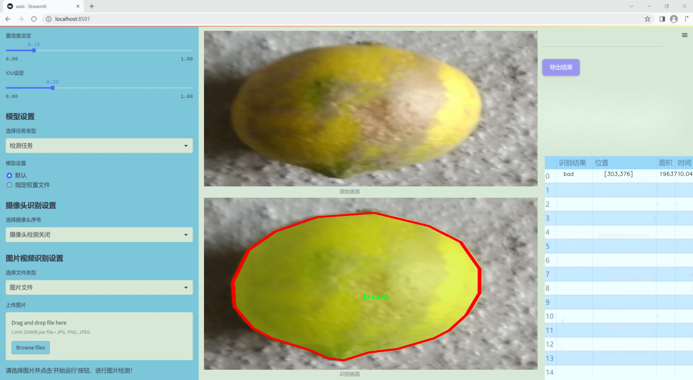
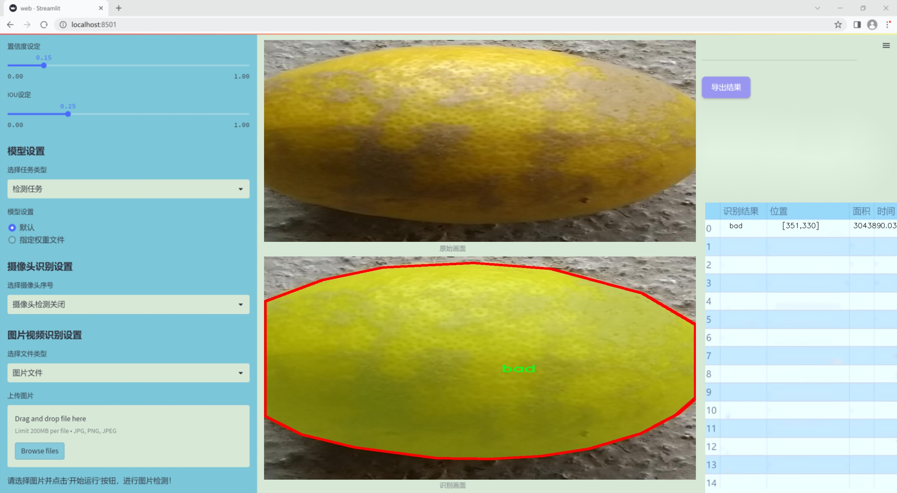
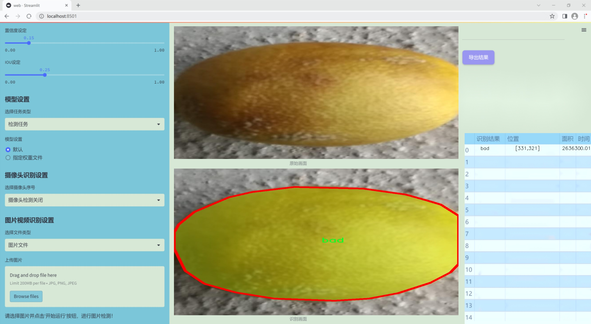
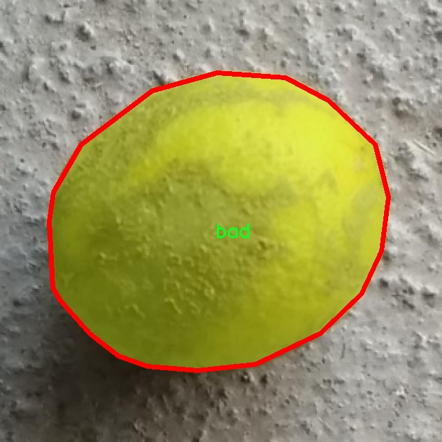
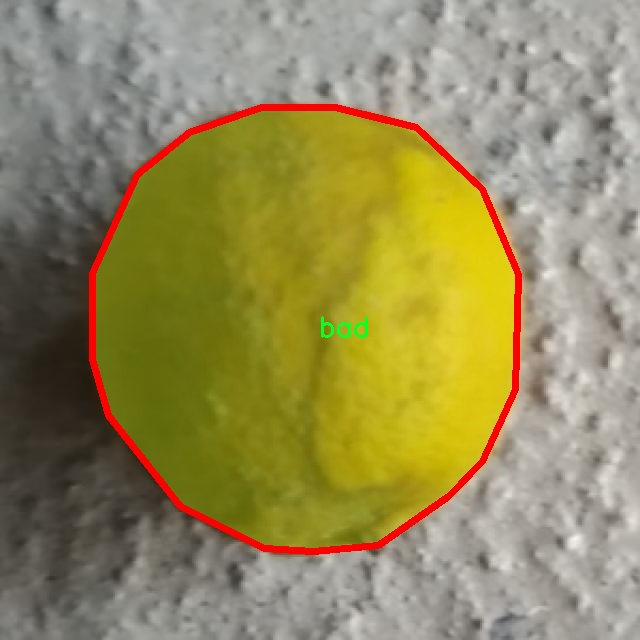
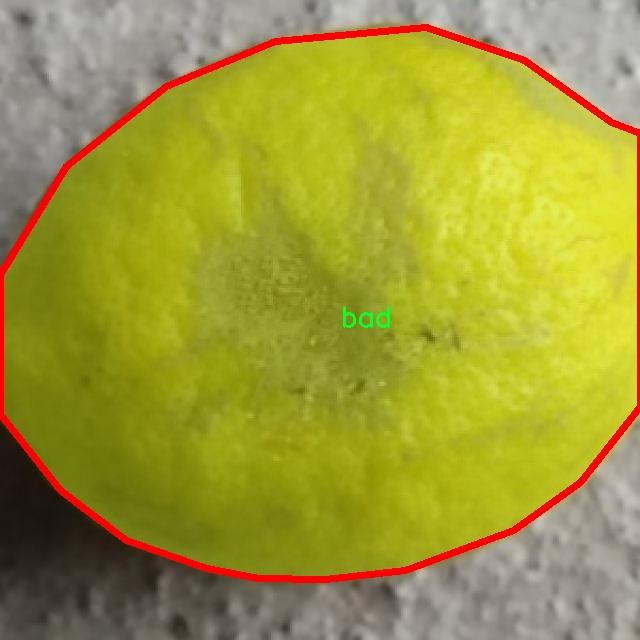
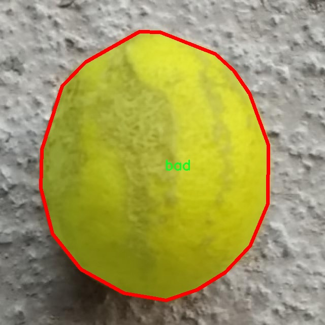
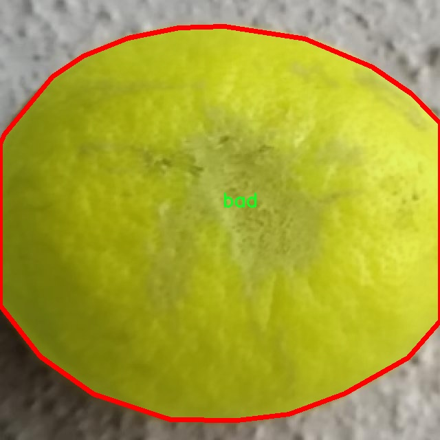

### 1.背景意义

研究背景与意义

随着全球经济的发展和人们生活水平的提高，食品安全和质量问题日益受到重视。柠檬作为一种广泛消费的水果，其质量直接影响到消费者的健康和市场的经济效益。因此，建立一个高效、准确的柠檬质量检测系统具有重要的现实意义。传统的柠檬质量检测方法多依赖人工检验，不仅耗时耗力，而且容易受到主观因素的影响，导致检测结果的不一致性。随着计算机视觉技术的快速发展，基于深度学习的自动化检测方法逐渐成为研究的热点。

本研究旨在基于改进的YOLOv11模型，构建一个高效的柠檬质量检测系统。YOLO（You Only Look Once）系列模型因其高效的实时检测能力和良好的准确性而广泛应用于物体检测领域。通过对YOLOv11的改进，结合针对柠檬质量的特定需求，我们可以实现对柠檬的快速、准确分类，从而提高生产效率，降低人工成本。

本项目所使用的数据集包含2100张柠檬图像，分为“好”和“坏”两类，能够有效支持模型的训练与评估。通过对这些图像的实例分割处理，系统能够识别柠檬的质量特征，进而实现对不同质量柠檬的自动分类。这不仅有助于提升柠檬的市场竞争力，也为相关企业提供了数据支持，促进其生产流程的优化。

综上所述，基于改进YOLOv11的柠檬质量检测系统的研究，不仅能够提升柠檬的质量控制水平，还将推动计算机视觉技术在农业领域的应用，为实现智能农业提供新的思路和方法。

### 2.视频效果

[2.1 视频效果](https://www.bilibili.com/video/BV1w3kEYqE1i/)

### 3.图片效果







##### [项目涉及的源码数据来源链接](https://kdocs.cn/l/cszuIiCKVNis)**

注意：本项目提供训练的数据集和训练教程,由于版本持续更新,暂不提供权重文件（best.pt）,请按照6.训练教程进行训练后实现上图演示的效果。

### 4.数据集信息

##### 4.1 本项目数据集类别数＆类别名

nc: 2
names: ['bad', 'good']


该项目为【图像分割】数据集，请在【训练教程和Web端加载模型教程（第三步）】这一步的时候按照【图像分割】部分的教程来训练

##### 4.2 本项目数据集信息介绍

本项目数据集信息介绍

本项目旨在开发一个改进版的YOLOv11模型，以实现柠檬质量检测系统的高效运作。为此，我们构建了一个专门针对柠檬质量评估的数据集，命名为“Lemon_quality”。该数据集包含两类柠檬样本，分别为“bad”（劣质）和“good”（优质），总类别数量为2。这一分类不仅为模型提供了清晰的目标，也为后续的质量检测算法提供了坚实的基础。

在数据集的构建过程中，我们精心挑选了来自不同环境和生长条件下的柠檬样本，以确保数据的多样性和代表性。每个类别的样本均经过严格筛选，确保“bad”类别的柠檬具有明显的缺陷特征，如表面斑点、变色、腐烂等，而“good”类别的柠檬则展现出鲜亮的颜色、光滑的表面和良好的形态。这种清晰的标注方式不仅有助于模型的训练，还能提高模型在实际应用中的准确性和可靠性。

数据集中的图像数量经过精心设计，以确保每个类别的样本均衡，避免模型在训练过程中出现偏差。此外，为了增强模型的泛化能力，我们还对图像进行了多种数据增强处理，包括旋转、缩放、翻转等操作，从而丰富了训练样本的多样性。通过这种方式，我们希望模型能够更好地适应不同环境下的柠檬质量检测任务。

综上所述，“Lemon_quality”数据集为改进YOLOv11模型提供了坚实的基础，旨在通过高效的质量检测手段，提升柠檬的市场竞争力，促进农业生产的可持续发展。











### 5.全套项目环境部署视频教程（零基础手把手教学）

[5.1 所需软件PyCharm和Anaconda安装教程（第一步）](https://www.bilibili.com/video/BV1BoC1YCEKi/?spm_id_from=333.999.0.0&vd_source=bc9aec86d164b67a7004b996143742dc)


[5.2 安装Python虚拟环境创建和依赖库安装视频教程（第二步）](https://www.bilibili.com/video/BV1ZoC1YCEBw?spm_id_from=333.788.videopod.sections&vd_source=bc9aec86d164b67a7004b996143742dc)

### 6.改进YOLOv11训练教程和Web_UI前端加载模型教程（零基础手把手教学）

[6.1 改进YOLOv11训练教程和Web_UI前端加载模型教程（第三步）](https://www.bilibili.com/video/BV1BoC1YCEhR?spm_id_from=333.788.videopod.sections&vd_source=bc9aec86d164b67a7004b996143742dc)


按照上面的训练视频教程链接加载项目提供的数据集，运行train.py即可开始训练



     Epoch   gpu_mem       box       obj       cls    labels  img_size
     1/200     20.8G   0.01576   0.01955  0.007536        22      1280: 100%|██████████| 849/849 [14:42<00:00,  1.04s/it]
               Class     Images     Labels          P          R     mAP@.5 mAP@.5:.95: 100%|██████████| 213/213 [01:14<00:00,  2.87it/s]
                 all       3395      17314      0.994      0.957      0.0957      0.0843

     Epoch   gpu_mem       box       obj       cls    labels  img_size
     2/200     20.8G   0.01578   0.01923  0.007006        22      1280: 100%|██████████| 849/849 [14:44<00:00,  1.04s/it]
               Class     Images     Labels          P          R     mAP@.5 mAP@.5:.95: 100%|██████████| 213/213 [01:12<00:00,  2.95it/s]
                 all       3395      17314      0.996      0.956      0.0957      0.0845

     Epoch   gpu_mem       box       obj       cls    labels  img_size
     3/200     20.8G   0.01561    0.0191  0.006895        27      1280: 100%|██████████| 849/849 [10:56<00:00,  1.29it/s]
               Class     Images     Labels          P          R     mAP@.5 mAP@.5:.95: 100%|███████   | 187/213 [00:52<00:00,  4.04it/s]
                 all       3395      17314      0.996      0.957      0.0957      0.0845


###### [项目数据集下载链接](https://kdocs.cn/l/cszuIiCKVNis)

### 7.原始YOLOv11算法讲解


##### YOLOv11三大损失函数

YOLOv11（You Only Look Once）是一种流行的目标检测算法，其损失函数设计用于同时优化分类和定位任务。YOLO的损失函数通常包括几个部分：
**分类损失、定位损失（边界框回归损失）和置信度损失** 。其中，

  1. box_loss（边界框回归损失）是用于优化预测边界框与真实边界框之间的差异的部分。

  2. cls_loss（分类损失）是用于优化模型对目标类别的预测准确性的部分。分类损失确保模型能够正确地识别出图像中的对象属于哪个类别。

  3. dfl_loss（Distribution Focal Loss）是YOLO系列中的一种损失函数，特别是在一些改进版本如YOLOv5和YOLOv7中被引入。它的主要目的是解决目标检测中的类别不平衡问题，并提高模型在处理小目标和困难样本时的性能。

##### 边界框回归损失详解

box_loss（边界框回归损失）是用于优化预测边界框与真实边界框之间的差异的部分。


##### box_loss 的具体意义


##### 为什么需要 box_loss

  * 精确定位：通过最小化中心点坐标损失和宽高损失，模型能够更准确地预测目标的位置和大小。
  * 平衡不同类型的目标：使用平方根来处理宽高损失，可以更好地平衡不同大小的目标，确保小目标也能得到足够的关注。
  * 稳定训练：适当的损失函数设计有助于模型的稳定训练，避免梯度爆炸或消失等问题。

##### 分类损失详解

在YOLO（You Only Look
Once）目标检测算法中，cls_loss（分类损失）是用于优化模型对目标类别的预测准确性的部分。分类损失确保模型能够正确地识别出图像中的对象属于哪个类别。下面是关于cls_loss的详细解读：

##### 分类损失 (cls_loss) 的具体意义

  
分类损失通常使用交叉熵损失（Cross-Entropy
Loss）来计算。交叉熵损失衡量的是模型预测的概率分布与真实标签之间的差异。在YOLO中，分类损失的具体形式如下：


##### 为什么需要 cls_loss

  * 类别识别：cls_loss 确保模型能够正确识别出图像中的目标属于哪个类别。这对于目标检测任务至关重要，因为不仅需要知道目标的位置，还需要知道目标的类型。

  * 多类别支持：通过最小化分类损失，模型可以处理多个类别的目标检测任务。例如，在道路缺陷检测中，可能需要识别裂缝、坑洞、路面破损等多种类型的缺陷。

  * 提高准确性：分类损失有助于提高模型的分类准确性，从而提升整体检测性能。通过优化分类损失，模型可以更好地学习不同类别之间的特征差异。

##### 分布损失详解

`dfl_loss`（Distribution Focal
Loss）是YOLO系列中的一种损失函数，特别是在一些改进版本如YOLOv5和YOLOv7中被引入。它的主要目的是解决目标检测中的类别不平衡问题，并提高模型在处理小目标和困难样本时的性能。下面是对`dfl_loss`的详细解读：

##### DFL Loss 的背景

在目标检测任务中，类别不平衡是一个常见的问题。某些类别的样本数量可能远远多于其他类别，这会导致模型在训练过程中对常见类别的学习效果较好，而对罕见类别的学习效果较差。此外，小目标和困难样本的检测也是一个挑战，因为这些目标通常具有较少的特征信息，容易被忽略或误分类。

为了应对这些问题，研究者们提出了多种改进方法，其中之一就是`dfl_loss`。`dfl_loss`通过引入分布焦点损失来增强模型对困难样本的关注，并改善类别不平衡问题。

##### DFL Loss 的定义

DFL Loss
通常与传统的交叉熵损失结合使用，以增强模型对困难样本的学习能力。其核心思想是通过对每个类别的预测概率进行加权，使得模型更加关注那些难以正确分类的样本。

DFL Loss 的公式可以表示为：


##### DFL Loss 的具体意义**

  * **类别不平衡：** 通过引入平衡因子 α，DFL Loss 可以更好地处理类别不平衡问题。对于少数类别的样本，可以通过增加其权重来提升其重要性，从而提高模型对这些类别的检测性能。
  *  **困难样本：** 通过聚焦参数 γ，DFL Loss 可以让模型更加关注那些难以正确分类的样本。当 
  * γ 较大时，模型会对那些预测概率较低的样本给予更多的关注，从而提高这些样本的分类准确性。
  *  **提高整体性能** ：DFL Loss 结合了传统交叉熵损失的优势，并通过加权机制增强了模型对困难样本的学习能力，从而提高了整体的检测性能。


### 8.200+种全套改进YOLOV11创新点原理讲解

#### 8.1 200+种全套改进YOLOV11创新点原理讲解大全

由于篇幅限制，每个创新点的具体原理讲解就不全部展开，具体见下列网址中的改进模块对应项目的技术原理博客网址【Blog】（创新点均为模块化搭建，原理适配YOLOv5~YOLOv11等各种版本）

[改进模块技术原理博客【Blog】网址链接](https://gitee.com/qunmasj/good)


#### 8.2 精选部分改进YOLOV11创新点原理讲解

###### 这里节选部分改进创新点展开原理讲解(完整的改进原理见上图和[改进模块技术原理博客链接](https://gitee.com/qunmasj/good)【如果此小节的图加载失败可以通过CSDN或者Github搜索该博客的标题访问原始博客，原始博客图片显示正常】


### OREPA：在线卷积重参数化
卷积神经网络(CNNs)已经在许多计算机视觉任务的应用成功，包括图像分类、目标检测、语义分割等。精度和模型效率之间的权衡也已被广泛讨论。

一般来说，一个精度较高的模型通常需要一个更复杂的块，一个更宽或更深的结构。然而，这样的模型总是太重，无法部署，特别是在硬件性能有限、需要实时推理的场景下。考虑到效率，更小、更紧凑和更快的模型自然是首选。

为了获得一个部署友好且高精度的模型，有研究者提出了基于结构重参数化的方法来释放性能。在这些方法中，模型在训练阶段和推理阶段有不同的结构。具体来说，使用复杂的训练阶段拓扑，即重参数化的块，来提高性能。训练结束后，通过等效变换将一个复杂的块重参为成一个单一的线性层。重参后的模型通常具有一个整洁架构模型，例如，通常是一个类似VGG的或一个类似ResNet的结构。从这个角度来看，重参化策略可以在不引入额外的推理时间成本的情况下提高模型的性能。


BN层是重构模型的关键组成部分。在一个重新解析块(图1(b))中，在每个卷积层之后立即添加一个BN层。可以观察到，去除这些BN层会导致的性能退化。然而，当考虑到效率时，这种BN层的使用出乎意料地在训练阶段带来了巨大的计算开销。在推理阶段，复杂的块可以被压缩成一个卷积层。但是，在训练过程中，BN层是非线性的，也就是说，它们将特征映射除以它的标准差，这就阻止了合并整个块。因此，存在大量的中间计算操作(large FLOPS)和缓冲特征映射(high memory usage)。更糟糕的是，这么高的训练预算使得很难探索更复杂和可能更强的重参块。很自然地，下面的问题就出现了：

为什么标准化在重参中这么重要？

通过分析和实验，作者认为BN层中的尺度因子最重要，因为它们能够使不同分支的优化方向多样化。

基于观察结果，作者提出了在线重参化(OREPA)(图1(c))，这是一个两阶段的pipeline，使之能够简化复杂的training-time re-param block。

在第一阶段，block linearization，去除所有的非线性BN层，并引入线性缩放层。这些层与BN层具有相似的性质，因此它们使不同分支的优化多样化。此外，这些层都是线性的，可以在训练过程中合并成卷积层。

第二阶段，block squeezing，将复杂的线性块简化为单一的卷积层。OREPA通过减少由中间计算层引起的计算和存储开销，显著降低了训练成本，对性能只有非常小的影响。

此外，高效化使得探索更复杂的重参化拓扑成为可能。为了验证这一点，作者进一步提出了几个重参化的组件，以获得更好的性能。

在ImageNet分类任务上评估了所提出的OREPA。与最先进的修复模型相比，OREPA将额外的训练时间GPU内存成本降低了65%到75%，并将训练过程加快了1.5-2.3倍。同时，OREPA-ResNet和OREPA-VGG的性能始终优于+0.2%∼+0.6%之前的DBB和RepVGG方法。同时作者还评估了在下游任务上的OREPA，即目标检测和语义分割。作者发现OREPA可以在这些任务上也可以带来性能的提高。

提出了在线卷积重参化(OREPA)策略，这极大地提高了重参化模型的训练效率，并使探索更强的重参化块成为可能；

通过对重参化模型工作机制的分析，用引入的线性尺度层代替BN层，这仍然提供了不同的优化方向，并保持了表示能力;

在各种视觉任务上的实验表明，OREPA在准确性和训练效率方面都优于以前的重参化模型(DBB/RepVGG)。


#### 结构重参化
结构重参化最近被重视并应用于许多计算机视觉任务，如紧凑模型设计、架构搜索和剪枝。重参化意味着不同的架构可以通过参数的等价转换来相互转换。例如，1×1卷积的一个分支和3×3卷积的一个分支，可以转移到3×3卷积的单个分支中。在训练阶段，设计了多分支和多层拓扑来取代普通的线性层(如conv或全连接层)来增强模型。Cao等讨论了如何在训练过程中合并深度可分离卷积核。然后在推理过程中，将训练时间的复杂模型转移到简单模型中，以便于更快的推理。

在受益于复杂的training-time拓扑，同时，当前的重参化方法训练使用不可忽略的额外计算成本。当块变得更复杂以变得更强的表示时，GPU内存利用率和训练时间将会越来越长，最终走向不可接受。与以往的重参化方法不同，本文更多地关注训练成本。提出了一种通用的在线卷积重参化策略，使training-time的结构重参化成为可能。


#### Normalization
BN被提出来缓解训练非常深度神经网络时的梯度消失问题。人们认为BN层是非常重要的，因为它们平滑了损失。最近关于无BN神经网络的研究声称，BN层并不是不可或缺的。通过良好的初始化和适当的正则化，可以优雅地去除BN层。

对于重参化模型，作者认为重参化块中的BN层是关键的。无BN的变体将会出现性能下降。然而，BN层是非线性的，也就是说，它们将特征图除以它的标准差，这阻止了在线合并块。为了使在线重参化可行，作者去掉了重参块中的所有BN层，并引入了BN层的线性替代方法，即线性缩放层。

#### 卷积分解
标准卷积层计算比较密集，导致大的FLOPs和参数量。因此，卷积分解方法被提出，并广泛应用于移动设备的轻量化模型中。重参化方法也可以看作是卷积分解的某种形式，但它更倾向于更复杂的拓扑结构。本文的方法的不同之处在于，在kernel-level上分解卷积，而不是在structure level。

#### 在线重参化
在本节中，首先，分析了关键组件，即重参化模型中的BN层，在此基础上提出了在线重参化(OREPA)，旨在大大减少再参数化模型的训练时间预算。OREPA能够将复杂的训练时间块简化为一个卷积层，并保持了较高的精度。

OREPA的整体pipeline如图所示，它包括一个Block Linearization阶段和一个Block Squeezing阶段。


参考该博客通过分析多层和多分支结构的优化多样性，深入研究了重参化的有效性，并证明了所提出的线性缩放层和BN层具有相似的效果。

最后，随着训练预算的减少，进一步探索了更多的组件，以实现更强的重参化模型，成本略有增加。

#### 重参化中的Normalization
作者认为中间BN层是重参化过程中多层和多分支结构的关键组成部分。以SoTA模型DBB和RepVGG为例，去除这些层会导致严重的性能下降，如表1所示。


这种观察结果也得到了Ding等人的实验支持。因此，作者认为中间的BN层对于重参化模型的性能是必不可少的。

然而，中间BN层的使用带来了更高的训练预算。作者注意到，在推理阶段，重参化块中的所有中间操作都是线性的，因此可以合并成一个卷积层，从而形成一个简单的结构。

但在训练过程中，BN层是非线性的，即它们将特征映射除以其标准差。因此，中间操作应该单独计算，这将导致更高的计算和内存成本。更糟糕的是，如此高的成本将阻止探索更强大的训练模块。

#### Block Linearization
如3.1中所述，中间的BN层阻止了在训练过程中合并单独的层。然而，由于性能问题，直接删除它们并不简单。为了解决这一困境，作者引入了channel级线性尺度操作作为BN的线性替代方法。

缩放层包含一个可学习的向量，它在通道维度中缩放特征映射。线性缩放层具有与BN层相似的效果，它们都促进多分支向不同的方向进行优化，这是重参化时性能提高的关键。除了对性能的影响外，线性缩放层还可以在训练过程中进行合并，使在线重参化成为可能。


基于线性缩放层，作者修改了重参化块，如图所示。具体来说，块的线性化阶段由以下3个步骤组成：

首先，删除了所有的非线性层，即重参化块中的BN层

其次，为了保持优化的多样性，在每个分支的末尾添加了一个缩放层，这是BN的线性替代方法

最后，为了稳定训练过程，在所有分支的添加后添加一个BN层。

一旦完成线性化阶段，在重参化块中只存在线性层，这意味着可以在训练阶段合并块中的所有组件。

#### Block Squeezing
Block Squeezing步骤将计算和内存昂贵的中间特征映射上的操作转换为更经济的kernel上的操作。这意味着在计算和内存方面从减少到，其中、是特征图和卷积核的空间尺寸。

一般来说，无论线性重参化块是多么复杂，以下2个属性始终成立：

Block中的所有线性层，例如深度卷积、平均池化和所提出的线性缩放，都可以用带有相应参数的退化卷积层来表示;

Block可以由一系列并行分支表示，每个分支由一系列卷积层组成。

有了上述两个特性，如果可以将

多层（即顺序结构）

多分支（即并行结构）

简化为单一卷积，就可以压缩一个块。在下面的部分中，将展示如何简化顺序结构(图(a))和并行结构(图(b))。


### 9.系统功能展示

图9.1.系统支持检测结果表格显示

  图9.2.系统支持置信度和IOU阈值手动调节

  图9.3.系统支持自定义加载权重文件best.pt(需要你通过步骤5中训练获得)

  图9.4.系统支持摄像头实时识别

  图9.5.系统支持图片识别

  图9.6.系统支持视频识别

  图9.7.系统支持识别结果文件自动保存

  图9.8.系统支持Excel导出检测结果数据


### 10. YOLOv11核心改进源码讲解

#### 10.1 ui.py

以下是经过精简和详细注释的核心代码部分：

```python
import sys
import subprocess

def run_script(script_path):
    """
    使用当前 Python 环境运行指定的脚本。

    Args:
        script_path (str): 要运行的脚本路径

    Returns:
        None
    """
    # 获取当前 Python 解释器的路径
    python_path = sys.executable

    # 构建运行命令，使用 streamlit 运行指定的脚本
    command = f'"{python_path}" -m streamlit run "{script_path}"'

    # 执行命令，并等待其完成
    result = subprocess.run(command, shell=True)
    
    # 检查命令执行结果，如果返回码不为0，则表示出错
    if result.returncode != 0:
        print("脚本运行出错。")

# 程序入口
if __name__ == "__main__":
    # 指定要运行的脚本路径
    script_path = "web.py"  # 假设脚本在当前目录下

    # 调用函数运行脚本
    run_script(script_path)
```

### 代码注释说明：

1. **导入模块**：
   - `sys`：用于获取当前 Python 解释器的路径。
   - `subprocess`：用于执行外部命令。

2. **`run_script` 函数**：
   - 接受一个参数 `script_path`，表示要运行的 Python 脚本的路径。
   - 使用 `sys.executable` 获取当前 Python 解释器的路径。
   - 构建一个命令字符串，使用 `streamlit` 模块运行指定的脚本。
   - 使用 `subprocess.run` 执行命令，并等待其完成。
   - 检查命令的返回码，如果不为0，打印错误信息。

3. **程序入口**：
   - 使用 `if __name__ == "__main__":` 确保只有在直接运行该脚本时才会执行以下代码。
   - 指定要运行的脚本路径为 `web.py`（假设该脚本在当前目录下）。
   - 调用 `run_script` 函数，传入脚本路径以运行该脚本。

这个程序文件 `ui.py` 的主要功能是运行一个指定的 Python 脚本，具体来说是通过 Streamlit 框架来启动一个 Web 应用。程序首先导入了必要的模块，包括 `sys`、`os` 和 `subprocess`，这些模块分别用于获取系统信息、处理文件路径和执行外部命令。

在 `run_script` 函数中，首先获取当前 Python 解释器的路径，这样可以确保使用正确的 Python 环境来运行脚本。接着，构建一个命令字符串，这个命令会调用 Streamlit 来运行指定的脚本。命令的格式是 `python -m streamlit run script_path`，其中 `script_path` 是传入的参数。

然后，使用 `subprocess.run` 方法执行这个命令。该方法会在新的进程中运行命令，并等待其完成。如果命令执行后返回的状态码不为零，表示脚本运行过程中出现了错误，此时会打印出“脚本运行出错”的提示信息。

在文件的最后部分，使用 `if __name__ == "__main__":` 语句来确保当这个文件作为主程序运行时才会执行后面的代码。这里指定了要运行的脚本路径为 `web.py`，并调用 `run_script` 函数来启动这个脚本。

总体来说，这个程序的设计简单明了，主要用于在当前 Python 环境中运行一个 Streamlit Web 应用，方便用户进行开发和测试。

#### 10.2 mobilenetv4.py

以下是经过简化并注释的核心代码部分，主要保留了 MobileNetV4 的结构和关键组件。

```python
import torch
import torch.nn as nn

# 定义模型的块规格，包括不同版本的 MobileNetV4
MODEL_SPECS = {
    "MobileNetV4ConvSmall": {
        "conv0": {"block_name": "convbn", "num_blocks": 1, "block_specs": [[3, 32, 3, 2]]},
        "layer1": {"block_name": "convbn", "num_blocks": 2, "block_specs": [[32, 32, 3, 2], [32, 32, 1, 1]]},
        "layer2": {"block_name": "convbn", "num_blocks": 2, "block_specs": [[32, 96, 3, 2], [96, 64, 1, 1]]},
        "layer3": {"block_name": "uib", "num_blocks": 6, "block_specs": [[64, 96, 5, 5, True, 2, 3], [96, 96, 0, 3, True, 1, 2]]},
        "layer4": {"block_name": "uib", "num_blocks": 6, "block_specs": [[96, 128, 3, 3, True, 2, 6], [128, 128, 5, 5, True, 1, 4]]},
        "layer5": {"block_name": "convbn", "num_blocks": 2, "block_specs": [[128, 960, 1, 1], [960, 1280, 1, 1]]}
    },
    # 其他模型规格可以在这里添加
}

def conv_2d(inp, oup, kernel_size=3, stride=1, groups=1, bias=False, norm=True, act=True):
    """
    创建一个2D卷积层，包含可选的批归一化和激活函数。
    
    Args:
        inp: 输入通道数
        oup: 输出通道数
        kernel_size: 卷积核大小
        stride: 步幅
        groups: 分组卷积
        bias: 是否使用偏置
        norm: 是否使用批归一化
        act: 是否使用激活函数
    
    Returns:
        nn.Sequential: 包含卷积层、批归一化和激活函数的序列
    """
    conv = nn.Sequential()
    padding = (kernel_size - 1) // 2  # 计算填充
    conv.add_module('conv', nn.Conv2d(inp, oup, kernel_size, stride, padding, bias=bias, groups=groups))
    if norm:
        conv.add_module('BatchNorm2d', nn.BatchNorm2d(oup))  # 添加批归一化
    if act:
        conv.add_module('Activation', nn.ReLU6())  # 添加ReLU6激活函数
    return conv

class InvertedResidual(nn.Module):
    """
    倒残差块，用于构建MobileNetV4的基本单元。
    """
    def __init__(self, inp, oup, stride, expand_ratio, act=False):
        super(InvertedResidual, self).__init__()
        self.stride = stride
        hidden_dim = int(round(inp * expand_ratio))  # 计算扩展后的维度
        self.block = nn.Sequential()
        if expand_ratio != 1:
            self.block.add_module('exp_1x1', conv_2d(inp, hidden_dim, kernel_size=1, stride=1))  # 扩展卷积
        self.block.add_module('conv_3x3', conv_2d(hidden_dim, hidden_dim, kernel_size=3, stride=stride, groups=hidden_dim))  # 深度卷积
        self.block.add_module('red_1x1', conv_2d(hidden_dim, oup, kernel_size=1, stride=1, act=act))  # 投影卷积
        self.use_res_connect = self.stride == 1 and inp == oup  # 判断是否使用残差连接

    def forward(self, x):
        if self.use_res_connect:
            return x + self.block(x)  # 使用残差连接
        else:
            return self.block(x)

def build_blocks(layer_spec):
    """
    根据层规格构建相应的层。
    
    Args:
        layer_spec: 层的规格信息
    
    Returns:
        nn.Sequential: 构建的层序列
    """
    if not layer_spec.get('block_name'):
        return nn.Sequential()
    block_names = layer_spec['block_name']
    layers = nn.Sequential()
    if block_names == "convbn":
        for i in range(layer_spec['num_blocks']):
            args = dict(zip(['inp', 'oup', 'kernel_size', 'stride'], layer_spec['block_specs'][i]))
            layers.add_module(f"convbn_{i}", conv_2d(**args))
    elif block_names == "uib":
        for i in range(layer_spec['num_blocks']):
            args = dict(zip(['inp', 'oup', 'start_dw_kernel_size', 'middle_dw_kernel_size', 'middle_dw_downsample', 'stride', 'expand_ratio'], layer_spec['block_specs'][i]))
            layers.add_module(f"uib_{i}", InvertedResidual(**args))
    return layers

class MobileNetV4(nn.Module):
    """
    MobileNetV4模型类，构建整个网络结构。
    """
    def __init__(self, model):
        super().__init__()
        assert model in MODEL_SPECS.keys()  # 确保模型在支持的规格中
        self.spec = MODEL_SPECS[model]
        # 构建各个层
        self.conv0 = build_blocks(self.spec['conv0'])
        self.layer1 = build_blocks(self.spec['layer1'])
        self.layer2 = build_blocks(self.spec['layer2'])
        self.layer3 = build_blocks(self.spec['layer3'])
        self.layer4 = build_blocks(self.spec['layer4'])
        self.layer5 = build_blocks(self.spec['layer5'])
        self.features = nn.ModuleList([self.conv0, self.layer1, self.layer2, self.layer3, self.layer4, self.layer5])  # 将所有层放入ModuleList

    def forward(self, x):
        features = []
        for f in self.features:
            x = f(x)  # 逐层前向传播
            features.append(x)  # 收集特征
        return features

# 创建不同版本的MobileNetV4模型
def MobileNetV4ConvSmall():
    return MobileNetV4('MobileNetV4ConvSmall')

# 主程序入口
if __name__ == '__main__':
    model = MobileNetV4ConvSmall()  # 创建MobileNetV4ConvSmall模型
    inputs = torch.randn((1, 3, 640, 640))  # 随机输入
    res = model(inputs)  # 前向传播
    for i in res:
        print(i.size())  # 打印每层输出的尺寸
```

### 代码说明：
1. **模型规格**：定义了不同版本的 MobileNetV4 的结构，包括每一层的卷积块和参数。
2. **卷积函数**：`conv_2d` 函数用于创建一个包含卷积、批归一化和激活函数的序列。
3. **倒残差块**：`InvertedResidual` 类实现了 MobileNetV4 的基本构建块，支持残差连接。
4. **构建层**：`build_blocks` 函数根据给定的规格构建相应的层。
5. **MobileNetV4 类**：定义了整个模型的结构，包含多个层的构建和前向传播逻辑。
6. **模型实例化**：提供了创建不同版本 MobileNetV4 模型的函数，并在主程序中展示了如何使用这些模型。

这个程序文件定义了一个名为 `mobilenetv4.py` 的深度学习模型，主要实现了 MobileNetV4 的不同变体，包括小型、中型、大型和混合型模型。文件中使用了 PyTorch 框架来构建神经网络。

首先，文件引入了一些必要的库和模块，包括 `torch` 和 `torch.nn`，并定义了一些常量和模型规格。模型规格以字典的形式存储，包含了不同层的结构信息，例如卷积层的数量、参数和类型。这些规格分为多个部分，分别对应不同的模型变体（如 `MobileNetV4ConvSmall`、`MobileNetV4ConvMedium` 等）。

接下来，定义了一个 `make_divisible` 函数，用于确保网络中所有层的通道数都是8的倍数。这是为了提高模型的效率和兼容性。

然后，定义了一个 `conv_2d` 函数，用于创建2D卷积层，并可选择性地添加批归一化和激活函数（ReLU6）。接着，定义了 `InvertedResidual` 类和 `UniversalInvertedBottleneckBlock` 类，这两个类实现了 MobileNetV4 中的倒残差块和通用倒瓶颈块。它们通过不同的卷积层组合来实现特征提取和维度变换。

`build_blocks` 函数根据给定的层规格构建相应的网络层。它根据层的类型（如 `convbn`、`uib`、`fused_ib`）选择合适的构建方式，并返回一个包含多个层的序列。

`MobileNetV4` 类是整个模型的核心，它根据传入的模型类型（如 `MobileNetV4ConvSmall` 等）构建相应的网络结构。构造函数中调用 `build_blocks` 函数来构建各个层，并将它们存储在一个模块列表中。`forward` 方法定义了前向传播的过程，并在特定的缩放比例下提取特征。

最后，文件提供了几个函数（如 `MobileNetV4ConvSmall`、`MobileNetV4ConvMedium` 等）用于实例化不同的 MobileNetV4 模型。主程序部分测试了 `MobileNetV4ConvSmall` 模型，生成一个随机输入并打印输出特征的尺寸。

整体来看，这个文件实现了 MobileNetV4 的多种变体，结构清晰，便于扩展和修改。通过使用模块化的设计，用户可以方便地构建和使用不同的模型，同时保持代码的可读性和可维护性。

#### 10.3 efficientViT.py

以下是经过简化和注释的核心代码部分，保留了模型的主要结构和功能。

```python
import torch
import torch.nn as nn
import torch.nn.functional as F
from timm.models.layers import SqueezeExcite

# 定义卷积层和批归一化的组合
class Conv2d_BN(torch.nn.Sequential):
    def __init__(self, in_channels, out_channels, kernel_size=1, stride=1, padding=0):
        super().__init__()
        # 添加卷积层
        self.add_module('conv', torch.nn.Conv2d(in_channels, out_channels, kernel_size, stride, padding, bias=False))
        # 添加批归一化层
        self.add_module('bn', torch.nn.BatchNorm2d(out_channels))

    @torch.no_grad()
    def switch_to_deploy(self):
        # 将训练模式下的卷积和批归一化合并为一个卷积层
        conv, bn = self._modules.values()
        w = bn.weight / (bn.running_var + bn.eps)**0.5
        w = conv.weight * w[:, None, None, None]
        b = bn.bias - bn.running_mean * bn.weight / (bn.running_var + bn.eps)**0.5
        # 创建新的卷积层并赋值权重和偏置
        new_conv = torch.nn.Conv2d(w.size(1) * conv.groups, w.size(0), w.shape[2:], stride=conv.stride, padding=conv.padding, dilation=conv.dilation, groups=conv.groups)
        new_conv.weight.data.copy_(w)
        new_conv.bias.data.copy_(b)
        return new_conv

# 定义高效ViT的基本块
class EfficientViTBlock(torch.nn.Module):
    def __init__(self, embed_dim, key_dim, num_heads=8, window_size=7):
        super().__init__()
        # 第一层卷积和激活
        self.dw0 = Conv2d_BN(embed_dim, embed_dim, kernel_size=3, stride=1, padding=1)
        # 注意力机制
        self.mixer = LocalWindowAttention(embed_dim, key_dim, num_heads, window_resolution=window_size)
        # 第二层卷积和激活
        self.dw1 = Conv2d_BN(embed_dim, embed_dim, kernel_size=3, stride=1, padding=1)

    def forward(self, x):
        # 前向传播
        x = self.dw0(x)
        x = self.mixer(x)
        x = self.dw1(x)
        return x

# 定义局部窗口注意力机制
class LocalWindowAttention(torch.nn.Module):
    def __init__(self, dim, key_dim, num_heads=8, window_resolution=7):
        super().__init__()
        self.attn = CascadedGroupAttention(dim, key_dim, num_heads, resolution=window_resolution)

    def forward(self, x):
        # 直接应用注意力机制
        return self.attn(x)

# 定义高效ViT模型
class EfficientViT(torch.nn.Module):
    def __init__(self, img_size=224, embed_dim=[64, 128, 192], depth=[1, 2, 3], num_heads=[4, 4, 4]):
        super().__init__()
        self.patch_embed = Conv2d_BN(3, embed_dim[0] // 8, kernel_size=3, stride=2, padding=1)
        self.blocks = nn.ModuleList()
        for i in range(len(depth)):
            for _ in range(depth[i]):
                self.blocks.append(EfficientViTBlock(embed_dim[i], embed_dim[i] // num_heads[i], num_heads[i]))

    def forward(self, x):
        x = self.patch_embed(x)
        for block in self.blocks:
            x = block(x)
        return x

# 实例化模型
if __name__ == '__main__':
    model = EfficientViT()
    inputs = torch.randn((1, 3, 224, 224))  # 输入图像的尺寸
    res = model(inputs)  # 前向传播
    print(res.size())  # 输出结果的尺寸
```

### 代码注释说明：
1. **Conv2d_BN**: 这个类结合了卷积层和批归一化层，提供了一个方便的接口来初始化和切换到部署模式。
2. **EfficientViTBlock**: 这是高效ViT的基本构建块，包含卷积层和局部窗口注意力机制。
3. **LocalWindowAttention**: 实现了局部窗口注意力机制，使用了级联组注意力。
4. **EfficientViT**: 这是整个模型的定义，包含了多个块和输入的嵌入层。
5. **主程序**: 实例化模型并进行前向传播，打印输出结果的尺寸。

这个程序文件 `efficientViT.py` 实现了一个高效的视觉变换器（Efficient Vision Transformer，EfficientViT）模型架构，主要用于图像处理的下游任务。代码中包含了多个类和函数，构成了整个模型的结构和功能。

首先，文件导入了必要的库，包括 PyTorch 及其相关模块，此外还引入了 `SqueezeExcite` 层，这是一个用于增强特征表示的机制。接着，定义了一些基础的组件，例如 `Conv2d_BN` 类，它结合了卷积层和批归一化层，并提供了一个用于推理时的转换方法 `switch_to_deploy`，可以将批归一化层的参数融合到卷积层中，从而提高推理效率。

接下来，定义了 `replace_batchnorm` 函数，用于在模型中替换掉所有的批归一化层，以便在推理时使用更高效的结构。然后是 `PatchMerging` 类，它实现了将输入特征图进行合并的操作，使用了卷积和激活函数，结合了 SqueezeExcite 机制，增强了特征的表达能力。

`Residual` 类实现了残差连接，允许在训练时引入一定的随机性，以提高模型的鲁棒性。`FFN` 类实现了前馈神经网络的结构，包含两个卷积层和一个激活函数。

`CascadedGroupAttention` 和 `LocalWindowAttention` 类实现了不同类型的注意力机制，前者用于处理全局特征，后者则专注于局部窗口内的特征。注意力机制是视觉变换器的核心部分，通过计算输入特征之间的关系来增强模型的表现。

`EfficientViTBlock` 类则是整个模型的基本构建块，结合了卷积、前馈网络和注意力机制，形成一个完整的处理单元。`EfficientViT` 类是模型的主要结构，负责将输入图像进行嵌入、经过多个块的处理，并输出特征。

在模型的初始化过程中，定义了不同的超参数，例如图像大小、补丁大小、嵌入维度、深度、头数等。模型的不同变体（如 `EfficientViT_M0` 到 `EfficientViT_M5`）通过字典形式定义了不同的配置。

最后，文件提供了一些函数用于创建不同配置的模型，并加载预训练权重，若需要，还可以融合批归一化层。`update_weight` 函数用于更新模型的权重，确保加载的权重与模型结构匹配。

在主程序部分，创建了一个 `EfficientViT_M0` 模型实例，并生成随机输入进行测试，输出每个阶段的特征图大小。这段代码展示了如何使用该模型进行推理。整体来看，这个文件实现了一个灵活且高效的视觉变换器架构，适用于多种图像处理任务。

#### 10.4 VanillaNet.py

以下是代码中最核心的部分，并附上详细的中文注释：

```python
import torch
import torch.nn as nn
import torch.nn.functional as F
from timm.layers import weight_init

# 定义激活函数类，继承自ReLU
class activation(nn.ReLU):
    def __init__(self, dim, act_num=3, deploy=False):
        super(activation, self).__init__()
        self.deploy = deploy  # 是否为部署模式
        # 初始化权重参数
        self.weight = torch.nn.Parameter(torch.randn(dim, 1, act_num*2 + 1, act_num*2 + 1))
        self.bias = None
        self.bn = nn.BatchNorm2d(dim, eps=1e-6)  # 批归一化
        self.dim = dim
        self.act_num = act_num
        weight_init.trunc_normal_(self.weight, std=.02)  # 权重初始化

    def forward(self, x):
        # 前向传播
        if self.deploy:
            # 部署模式下的卷积操作
            return torch.nn.functional.conv2d(
                super(activation, self).forward(x), 
                self.weight, self.bias, padding=(self.act_num*2 + 1)//2, groups=self.dim)
        else:
            # 非部署模式下的卷积操作，先经过批归一化
            return self.bn(torch.nn.functional.conv2d(
                super(activation, self).forward(x),
                self.weight, padding=self.act_num, groups=self.dim))

    def switch_to_deploy(self):
        # 切换到部署模式
        if not self.deploy:
            kernel, bias = self._fuse_bn_tensor(self.weight, self.bn)  # 融合BN层
            self.weight.data = kernel
            self.bias = torch.nn.Parameter(torch.zeros(self.dim))
            self.bias.data = bias
            self.__delattr__('bn')  # 删除bn属性
            self.deploy = True

class Block(nn.Module):
    def __init__(self, dim, dim_out, act_num=3, stride=2, deploy=False):
        super().__init__()
        self.deploy = deploy
        # 根据是否部署选择不同的卷积结构
        if self.deploy:
            self.conv = nn.Conv2d(dim, dim_out, kernel_size=1)
        else:
            self.conv1 = nn.Sequential(
                nn.Conv2d(dim, dim, kernel_size=1),
                nn.BatchNorm2d(dim, eps=1e-6),
            )
            self.conv2 = nn.Sequential(
                nn.Conv2d(dim, dim_out, kernel_size=1),
                nn.BatchNorm2d(dim_out, eps=1e-6)
            )
        # 池化层的选择
        self.pool = nn.MaxPool2d(stride) if stride != 1 else nn.Identity()
        self.act = activation(dim_out, act_num)  # 激活函数

    def forward(self, x):
        # 前向传播
        if self.deploy:
            x = self.conv(x)
        else:
            x = self.conv1(x)
            x = F.leaky_relu(x, negative_slope=1)  # 使用Leaky ReLU激活
            x = self.conv2(x)

        x = self.pool(x)  # 池化操作
        x = self.act(x)  # 激活操作
        return x

class VanillaNet(nn.Module):
    def __init__(self, in_chans=3, num_classes=1000, dims=[96, 192, 384, 768], 
                 drop_rate=0, act_num=3, strides=[2,2,2,1], deploy=False):
        super().__init__()
        self.deploy = deploy
        # 初始化网络的stem部分
        if self.deploy:
            self.stem = nn.Sequential(
                nn.Conv2d(in_chans, dims[0], kernel_size=4, stride=4),
                activation(dims[0], act_num)
            )
        else:
            self.stem1 = nn.Sequential(
                nn.Conv2d(in_chans, dims[0], kernel_size=4, stride=4),
                nn.BatchNorm2d(dims[0], eps=1e-6),
            )
            self.stem2 = nn.Sequential(
                nn.Conv2d(dims[0], dims[0], kernel_size=1, stride=1),
                nn.BatchNorm2d(dims[0], eps=1e-6),
                activation(dims[0], act_num)
            )

        self.stages = nn.ModuleList()
        # 构建多个Block
        for i in range(len(strides)):
            stage = Block(dim=dims[i], dim_out=dims[i+1], act_num=act_num, stride=strides[i], deploy=deploy)
            self.stages.append(stage)

    def forward(self, x):
        # 前向传播
        if self.deploy:
            x = self.stem(x)
        else:
            x = self.stem1(x)
            x = F.leaky_relu(x, negative_slope=1)
            x = self.stem2(x)

        for stage in self.stages:
            x = stage(x)  # 依次通过每个Block
        return x

# 测试模型
if __name__ == '__main__':
    inputs = torch.randn((1, 3, 640, 640))  # 随机输入
    model = VanillaNet()  # 创建模型
    pred = model(inputs)  # 前向传播
    print(pred.size())  # 输出预测结果的尺寸
```

### 代码核心部分说明：
1. **激活函数类（activation）**：实现了一个自定义的激活函数，支持在训练和部署模式之间切换，并融合了批归一化（Batch Normalization）层。
2. **Block类**：表示网络中的一个基本模块，包含卷积层、池化层和激活函数。根据是否处于部署模式，选择不同的结构。
3. **VanillaNet类**：整个网络的构建，包含stem部分和多个Block。前向传播过程中依次通过这些模块，最终输出特征图。
4. **测试部分**：在主程序中，创建一个随机输入并通过模型进行前向传播，输出结果的尺寸。

这个程序文件 `VanillaNet.py` 实现了一个名为 VanillaNet 的深度学习模型，主要用于图像处理任务。文件开头包含版权信息和许可协议，表明该程序是自由软件，可以在 MIT 许可证下进行再分发和修改。

文件中导入了 PyTorch 库及其相关模块，使用了 `timm` 库中的一些功能，如权重初始化和 DropPath。接下来，定义了一个名为 `activation` 的类，它继承自 `nn.ReLU`，用于实现自定义的激活函数。该类在初始化时创建了一个可学习的权重参数和一个批量归一化层，并定义了前向传播的方法。在前向传播中，根据 `deploy` 标志选择不同的计算路径。

接着，定义了一个 `Block` 类，表示模型中的基本构建块。该类包含两个卷积层和一个激活层，支持可选的自适应池化。`Block` 类的 `forward` 方法实现了前向传播逻辑，使用 `activation` 类进行激活处理，并根据步幅选择池化操作。

然后，定义了 `VanillaNet` 类，这是整个模型的核心。它包含多个 `Block`，并在初始化时设置输入通道、类别数、各层的维度、丢弃率等参数。模型的前向传播方法处理输入数据，并在不同的尺度上提取特征。

文件中还实现了权重更新的辅助函数 `update_weight`，用于加载预训练模型的权重。随后，定义了一系列函数（如 `vanillanet_5` 到 `vanillanet_13_x1_5_ada_pool`），这些函数用于创建不同配置的 VanillaNet 模型，并支持加载预训练权重。

最后，在 `__main__` 部分，创建了一个随机输入并实例化了一个 VanillaNet 模型，进行前向传播并打印输出特征的尺寸。这部分代码用于测试模型的基本功能。

整体来看，该文件实现了一个灵活且可扩展的卷积神经网络结构，适用于多种图像处理任务，具有可调节的激活函数和多种配置选项。

### 11.完整训练+Web前端界面+200+种全套创新点源码、数据集获取


# [下载链接：https://mbd.pub/o/bread/Z5yampdt](https://mbd.pub/o/bread/Z5yampdt)